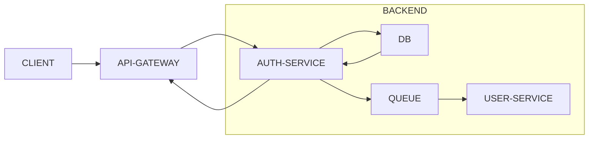
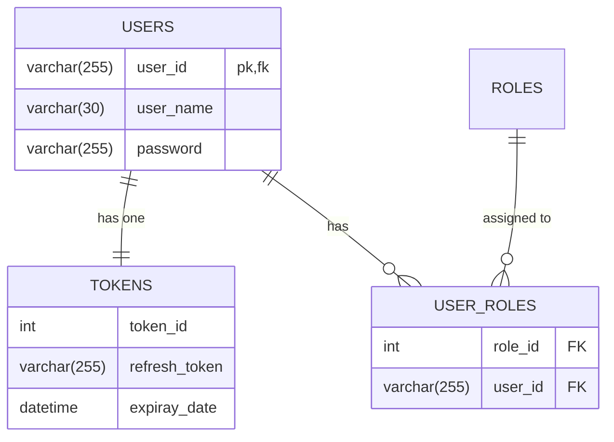

## **Expense Tracker**

### _Must Have_
* User is able to Log In and SignUp
* User is able to add/ remove the expense manually
* User is able to see his expenses, Categorised expenses
* User is able to weekly, monthly, yearly report and statistics about the spending
* statistics can be downloaded in file (csv, pdf)

### Good to have
* fault tolerance, scalable system
* system latency < 100ms
* config driven system ,,, less code changes in future

### Future
* User is able to track their financial behaviour
* AI can suggest
* App should be able ti add expense on its own by reading and parsing sms
* Notification indicating various things like ris, overspending etc. (WhatsApp , SMS)

### Auth HLD

### Auth Sequence

```mermaid
sequenceDiagram
    actor Client
    
    participant SecurityConfig
    participant JWTFilter
    participant AuthController
    participant TokenController
    participant JWTService
    participant RefreshTokenService
    participant UserDetailsServiceIMPL
    participant EventPublisher
    participant AuthenticationManager

    rect rgb(0, 0, 0)
        note right of Client: SignUp FLow
        Client->>+AuthController:api/v1/signup
        AuthController->>+UserDetailsServiceIMPL:sign up the user
        UserDetailsServiceIMPL-->>EventPublisher:Publish event to the queue
        UserDetailsServiceIMPL->>AuthController:success or throw an error
        AuthController->>-Client:Response with status code
        UserDetailsServiceIMPL->>-DB:save user to DB
    end


    rect rgb(12, 0, 100)
        note right of Client: Login FLow
        Client->>+TokenController:api/v1/login
        TokenController->>+AuthenticationManager:Check if authenticated
        AuthenticationManager->>-TokenController:isAuthenticatedResponse
        TokenController->>+RefreshTokenService:createRefreshToken
        RefreshTokenService->>+DB:fetchByUsername
        DB->>RefreshTokenService:fetchedUser
        RefreshTokenService->>DB:save new refresh token
        TokenController->>+JWTService:createJwtToken
        JWTService->>-TokenController:JWT token
        RefreshTokenService->>-TokenController:refresh token
        TokenController->>-Client:return JWT Token and refresh token
    end
    
    rect rgb(73, 0, 92)
        note right of Client: Refresh Token
        Client->>+TokenController:api/v1/refreshToken
        TokenController->>+RefreshTokenService:fetchToken and verifyExpiration
        RefreshTokenService->>+DB:fetch userInfo By Token
        DB->>-RefreshTokenService:userInfo and Token Returned
        TokenController->>JWTService:generate Token if refreshToken is valid
        JWTService->>TokenController:new JWT returned
        TokenController->>-Client:response with refreshToken and accessToken
    end

    rect rgb(0, 0, 0)
        note right of Client: Other Requests
        Client->>+JWTFilter:All Other Requests
        JWTFilter->>+UserDetailsServiceIMPL:Fetch userDetails if securityContextHolder doesn't have any context of auth
        UserDetailsServiceIMPL->>+DB:fetch user
        DB->>-UserDetailsServiceIMPL:fetched user
        UserDetailsServiceIMPL->>-JWTFilter:set Security Context
        JWTFilter->>-Client:isAuthenticated or Not
    end
    
```

## ER Diagram

